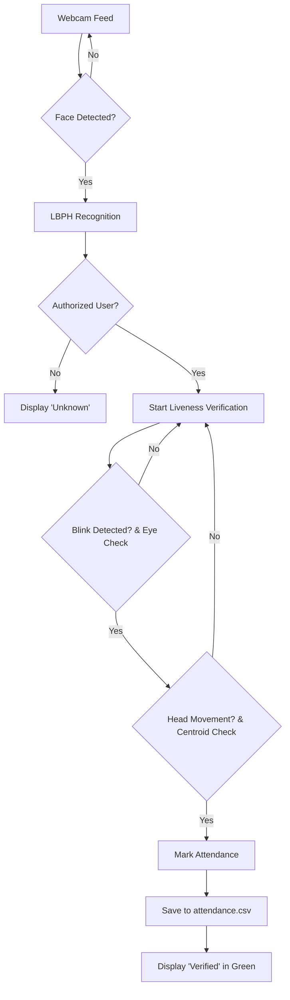

# Face Attendance System with Anti-Spoofing (Liveness Detection)

This is a real-time face attendance system built with Python and OpenCV. It features anti-spoofing (Liveness Detection) using built-in OpenCV Haarcascades and LBPH recognition, making it universally compatible with Python 3.14+ and Windows without needing heavy C++ build tools.


## 🔹 Features
- **Face Detection**: Fast real-time detection via **OpenCV Haarcascades**.
- **Face Recognition**: Lightweight **OpenCV LBPH** algorithm (Universal Compatibility).
- **Anti-Spoofing**:
  - **Blink Detection**: Monitors facial regions for specific eye patterns using Eye Cascades.
  - **Head Movement Detection**: Tracks centroid displacement to verify 3D presence.
- **Attendance Logging**: Automatically saves Name, Date, and Time to `attendance.csv`.

## 🛠️ Tech Stack
- **Python 3.14+** (Optimized for latest versions)
- **OpenCV (Contrib)**: The core engine for detection, tracking, and recognition.
- **NumPy & Pandas**: Data handling and logging.

## 📂 Project Structure
```text
face-attendance-system/
├── dataset/             # User facial images (10 samples per user)
├── encodings/           # Serialized LBPH model and name mapping
├── liveness_detection.py # Eye detection and Centroid tracking logic
├── register_face.py     # Script to add new users and train model
├── recognize_attendance.py # Main real-time system
├── attendance.csv       # Attendance records
├── requirements.txt
└── README.md
```

## 🚀 Getting Started

### 1. Install Dependencies
```bash
pip install opencv-contrib-python numpy pandas
```

### 2. Register a User
Run the registration script. Enter the user name when prompted and press **'c'** to capture 10 images.
```bash
python register_face.py
```

### 3. Run Attendance System
Run the main script. The system will recognize the user and wait for liveness (blink + movement) before marking attendance.
```bash
python recognize_attendance.py
```

## 📊 System Architecture


## 🧠 Technical Explanation

### Liveness Verification Logic
1. **Blink Detection**: The system looks for the momentary absence of eye features (using Eye Haarcascades) within the detected face area to register a natural blink.
2. **Centroid Tracking**: By measuring the distance between the face's starting center and the current position, the system verifies the user is performing a physical movement.

### Anti-Spoofing Defense Strategy
| Attack Type | Defense Method | Logic |
| :--- | :--- | :--- |
| **Static Photo** | Eye Check | Photos cannot mimic the sequence of eye detection/absence. |
| **Video Replay** | Centroid Tracking | Video playback usually lacks the natural translational movement tracking required. |
| **Deepfake/Display** | Physical Requirement | Requires the user to actively change position relative to the camera. |

## 💡 Tips for Better Accuracy
- **Lighting**: Bright, frontal lighting yields the best recognition.
- **Distance**: Maintain a distance of ~50-100cm from the webcam.
- **Samples**: Ensure you capture different head angles during the registration phase.

---
Developed for BTech CSE Final Year Project.
